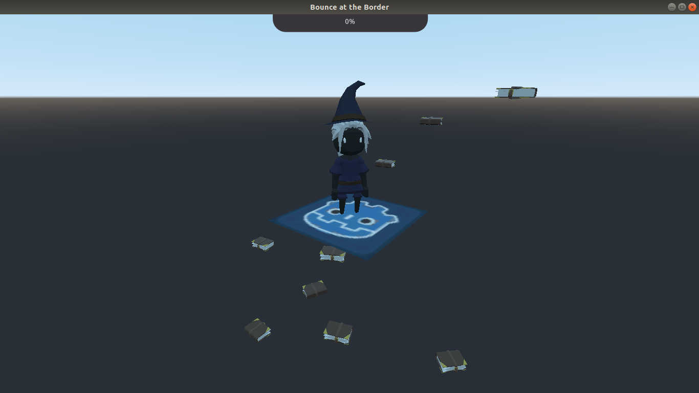

# GameOff 2019

**Game Off:** Creating games in **about 30 days** with *open source tools*.

[About](#About),
[Gameplay](#Gameplay)

***

## About
* **Theme**: *LEAPS AND BOUNDS*
* **Name**: *[Bounce at the Border](./Bounce-at-the-Border)*
* **Description**: *Take books pass level*
* **Images**: 
* **Tools**: Godot (v3.2.beta2.mono.official), Blender (v2.80) + Addon(Godot Blender Exporter)
* **ThirdParty**: [ThirdParty](./Resources/ThirdParty.md)
* **Keywords**: 3D, Third Person, Godot, Blender, Open source

***

## Gameplay

* The witch searching her books. Take all books and pass the level... 
* Keys:
  * Movement: W, A, S, D 
  * Create Step: Q or Shift
  * Take Book: E
  * Reset Steps: R
  * Find Book: 1
  * Next Level: F or Click Portal
  * Restart Level: P

***
