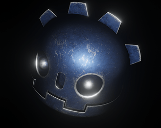

# GameOffs
Game Off projects repositories will be here...

**Game Off:** Creating games in **about 30 days** with *open source tools*.

[Tools](#Tools)

### License
**Third Party Licenses:** Each project ***Third Party Resource*** has its own license. So look at,
  * **Third Party Licenses:** "*ProjectName*" > "Resources" > "ThirdParty.md", the link can also be accessed from below.

**Art License:** Each project resource under [CC-BY-4.0](https://creativecommons.org/licenses/by/4.0/).
 * **Arts Folder:** "*ProjectName*" > "Resources" > "Arts"

**License:** GameOff Projects and this repositories under [MIT](./LICENSE).

### GameOffs:
* [2018](#Game-Off-2018)
* [2019](#Game-Off-2019)

### Tools
* [Blender](http://blender.org/)
* [Krita](https://krita.org/)
* [LMMS](https://lmms.io/)
* [Godot](https://godotengine.org/)
* [MakeHuman](http://www.makehumancommunity.org/)
* [Inkscape](https://inkscape.org/)
* [GIMP](https://www.gimp.org/)
* [Audacity](https://www.audacityteam.org/)
* [Git/Github](https://github.com)

## Game Offs

***

### Game Off 2018

* **Theme**: *HYBRID*
* **Name**: *[Ways of Godot](./GameOff2018)*
* **Description**: *Let's find Godot.*
* **Image**:  
* **Tools**: *Godot (v3.1_a2)*
* **Comment**: Godot will be good engine, but it doesn't ready for 3D in v3.06-v3.1_alpha2. So We 'Waiting for Godot'...  
* **ThirdParty**: [ThirdParty](./GameOff2018/Resources/ThirdParty.md)

***

### Game Off 2019

* **Theme**: *LEAPS AND BOUNDS*
* **Name**: *[Bounce at the Border](./GameOff2019)*
* **Description**: *Take books pass level*
* **Image**: 
* **Tools**: *Godot (v3.2.beta2.mono.official), Blender (v2.80) + Addon(Godot Blender Exporter)*
* **ThirdParty**: [ThirdParty](./GameOff2019/Resources/ThirdParty.md)

***