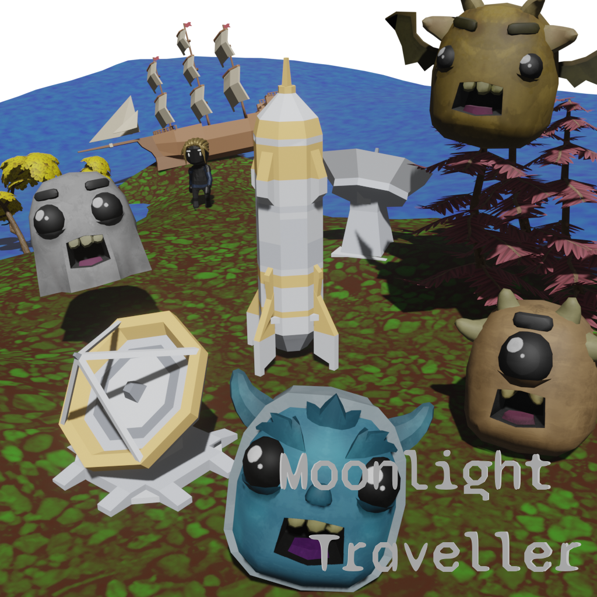

# GameOffs
Game Off projects repositories will be here...

**Game Off:** Creating games in **about 30 days** with *open source tools*. About 3-5 days in reality. 

## License
**Project Licenses:** GameOff Projects and this repositories under [MIT](./LICENSE). 

**Third Party Licenses:** Each project ***Third Party Resources*** has its own license. So look at, "ProjectName" > "Resources" > "ThirdParty.md", the link can also be accessed from below.

## GameOffs:
* [2020](#Game-Off-2020)
* [2019](#Game-Off-2019)
* [2018](#Game-Off-2018)

### Tools
* [Blender](http://blender.org/)
* [Krita](https://krita.org/)
* [Godot](https://godotengine.org/)
* [Inkscape](https://inkscape.org/)
* [MuseScore](https://musescore.org/)
* [Audacity](https://www.audacityteam.org/)
* [Git/Github](https://github.com)

#### Other Tools
* [MakeHuman](http://www.makehumancommunity.org/)
* [LMMS](https://lmms.io/)
* [GIMP](https://www.gimp.org/)
* [Twine](https://twinery.org/)

## Game Offs

***

### Game Off 2020

<!--  -->

* **Theme**: *MOONSHOT*
* **Name**: *[Moonlight Traveller](./GameOff2020)*
* **Description**: **
* **Tools**: *Godot (v3.2.3.mono), Blender (v2.83 & v2.90) + Addon(Godot Blender Exporter)*
* **Comment**: Although Godot has nice features, it still has a long way to go. I was busy this month.
* **ThirdParty**: [ThirdParty](./GameOff2020/Resources/ThirdParty.md)

***

### Game Off 2019

* **Theme**: *LEAPS AND BOUNDS*
* **Name**: *[Bounce at the Border](./GameOff2019)*
* **Description**: *Take books pass level*
* **Tools**: *Godot (v3.2.beta2.mono.official), Blender (v2.80) + Addon(Godot Blender Exporter)*
* **ThirdParty**: [ThirdParty](./GameOff2019/Resources/ThirdParty.md)

***

### Game Off 2018

* **Theme**: *HYBRID*
* **Name**: *[Ways of Godot](./GameOff2018)*
* **Description**: *Let's find Godot.*
* **Tools**: *Godot (v3.1_a2)*
* **Comment**: Godot will be good engine, but it doesn't ready for 3D in v3.06-v3.1_alpha2. So We 'Waiting for Godot'...  
* **ThirdParty**: [ThirdParty](./GameOff2018/Resources/ThirdParty.md)

***

